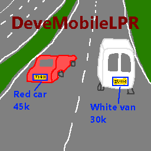

<p align="center">
  
</p>

# DeveMobileLPR

DeveMobileLPR is an offline-first .NET MAUI app for Dutch license-plate recognition on Android and Windows. It supports live camera recognition, recorded-video analysis, trip history, optional location, and local RDW vehicle lookup. Recognition and storage stay on the device; raw frames and plate crops are not persisted.

## Highlights

- Android CameraX and Windows webcam capture with latest-frame backpressure.
- YOLOv9-S plate detection and CCT-S V2 OCR.
- Android LiteRT GPU inference with explicit CPU fallback.
- Windows ONNX Runtime with DirectML and CPU fallback.
- Multi-frame tracking and consensus with Dutch sidecode validation.
- Recorded-video analysis using the same recognition pipeline as live capture.
- Local SQLite history, trips, optional routes, CSV export, and RDW enrichment.
- No remote inference, analytics, telemetry, or media uploads.

## Build

Requirements:

- The .NET SDK selected by `global.json`.
- The .NET MAUI Android and Windows workloads: `dotnet workload install maui-android maui-windows`.
- PowerShell 7.
- Docker when generating Android LiteRT models.

Run the complete Release build, tests, model verification, and publishing pipeline:

```powershell
./build.ps1 -Configuration Release
```

Skip Android model generation and packaging when working only on portable or Windows code:

```powershell
./build.ps1 -Configuration Release -SkipAndroid
```

Published outputs are written under `artifacts/android`, `artifacts/windows/win-x64`, and `artifacts/rdw-downloader`. CI publishes one arm64 Android APK containing both LiteRT models. Android uses CoreCLR because it substantially improves managed detector preprocessing on the tested Pixel 9; .NET 10 still classifies CoreCLR on Android as experimental and not intended for production use. The published APK does not support x64 emulators.

## RDW database

Vehicle enrichment is optional. Build an indexed local database from official RDW Open Data:

```powershell
dotnet run --project ./src/DeveMobileLPR.RdwDownloader -c Release -- `
  --output C:\RdwData\rdw.sqlite
```

Import the resulting file from Settings. Recognition and history continue to work without it. See [RDW database](docs/rdw-database.md) for sizing, resumability, validation, and token configuration.

## Documentation

- [Architecture](docs/architecture.md)
- [Product experience](docs/product-experience.md)
- [UI design system](docs/ui-design-system.md)
- [Pixel 9 inference performance](docs/android-inference-performance-pixel-9.md)
- [RDW database](docs/rdw-database.md)
- [Third-party notices](THIRD-PARTY-NOTICES.md)

## Safety and privacy

Mount the phone securely, configure the app before driving, and do not interact with it while the vehicle is moving. Location is optional.

Android stops an active drive when the app leaves the foreground by default. The opt-in **Continue in background** setting keeps camera recognition running through a foreground service and a persistent notification until the drive is stopped. Raw camera frames are still discarded after processing.

License plates and travel history can be personal data. Protect the device, retain only necessary data, and determine the lawful basis for use in your jurisdiction. This project is not legal advice.
