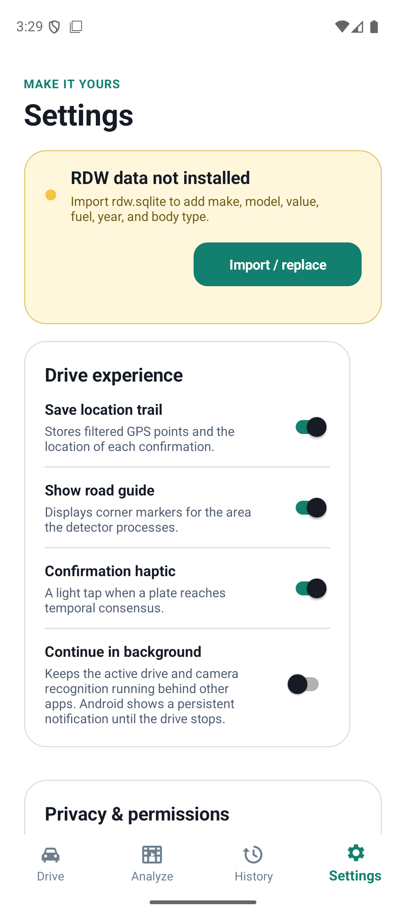
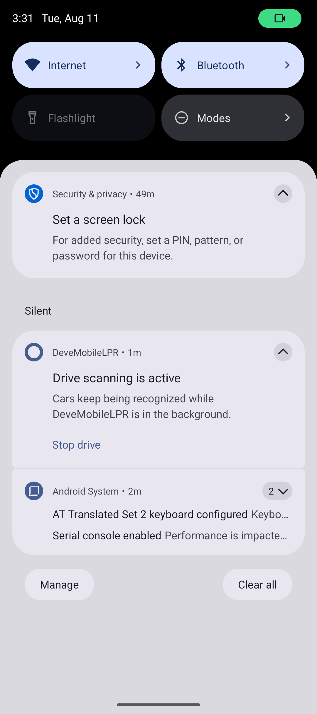

# Android background scanning

Captured on the Pixel 9 API 36 emulator at 1080 × 2424. The branch is intentionally independent from the Android layout-polish branch.

## Opt-in setting

The default remains foreground-only. Android users can explicitly keep an active drive running behind other apps.

| Before | After |
|---|---|
|  |  |

## Active background drive

The green Android privacy chip confirms that the camera remains in use after the emulator Home button is pressed. The persistent notification explains why and provides a direct **Stop drive** action.

## Emulator verification

- Toggle off: pressing Home stopped the active drive; no foreground service remained and CameraX disconnected.
- Toggle on: pressing Home kept `BackgroundScanningService` in the foreground with camera + location service types (`0x48`).
- `dumpsys media.camera` showed `nl.deve.mobilelpr` as the active camera client after the app entered the background.
- A 150 ms Start-drive → Home stress case still established the camera + location foreground service and kept CameraX connected, with no `SecurityException` or background-start exception.
- Tapping **Stop drive** removed the foreground service, disconnected the camera, and produced no fatal or security exceptions.
- Android and Windows builds completed with 0 warnings and 0 errors.
- 213 automated tests passed; the existing model-backed replay test was skipped by the non-model test filter.
