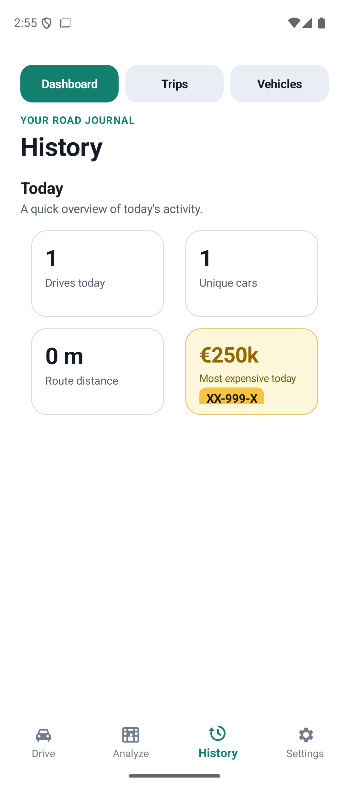
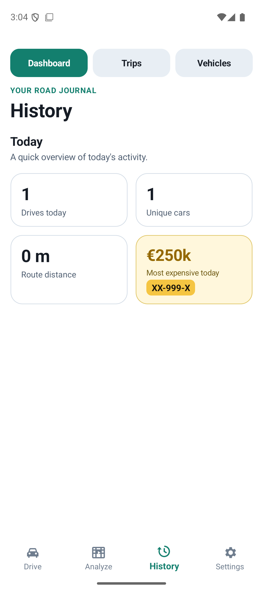
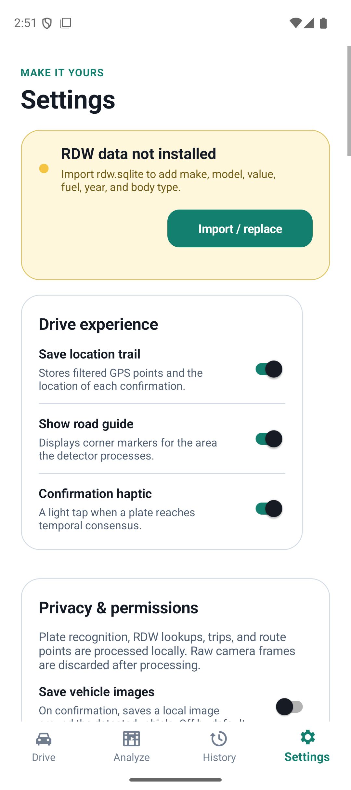
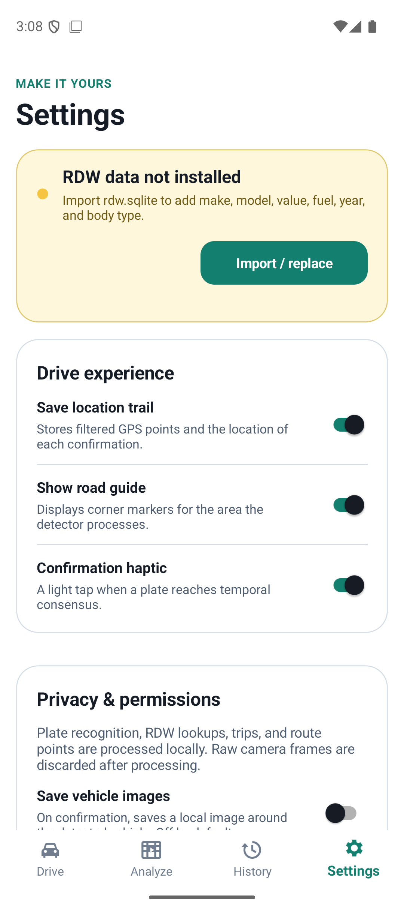
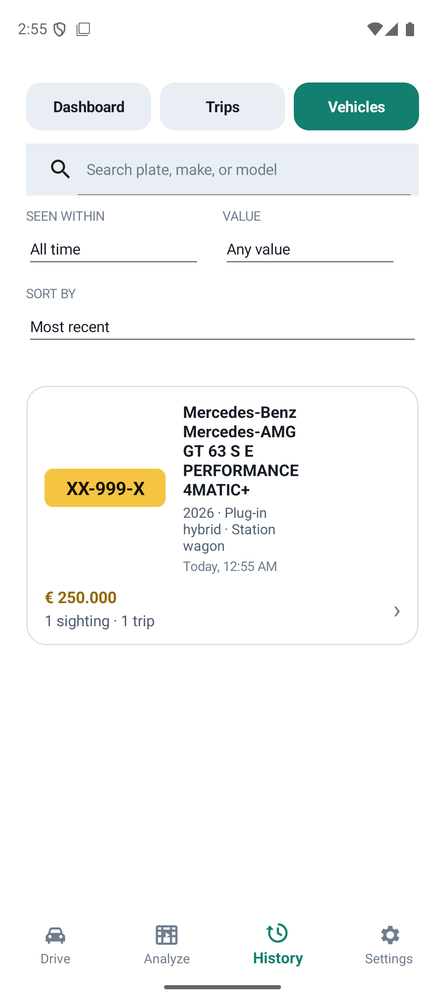
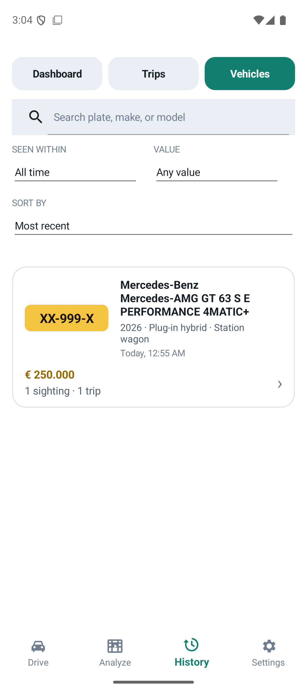
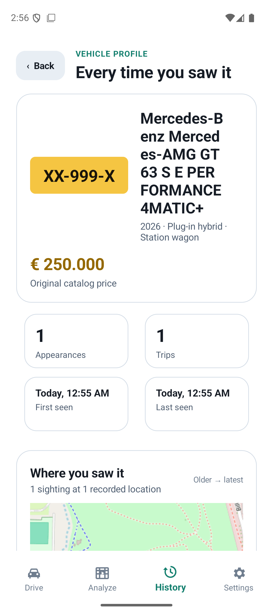
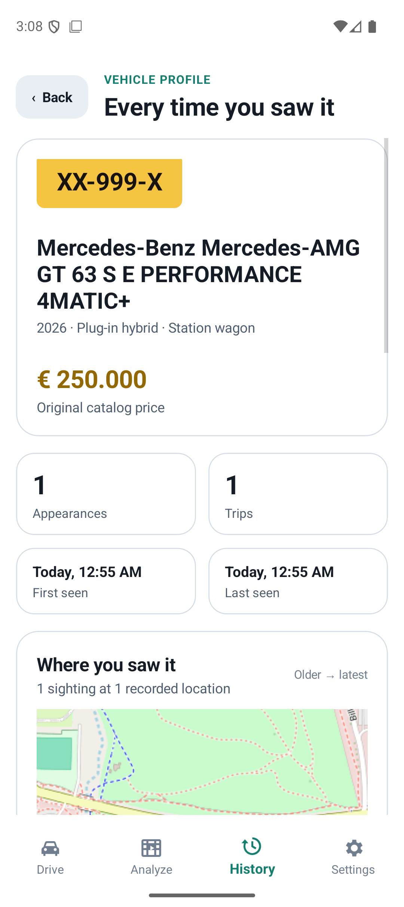
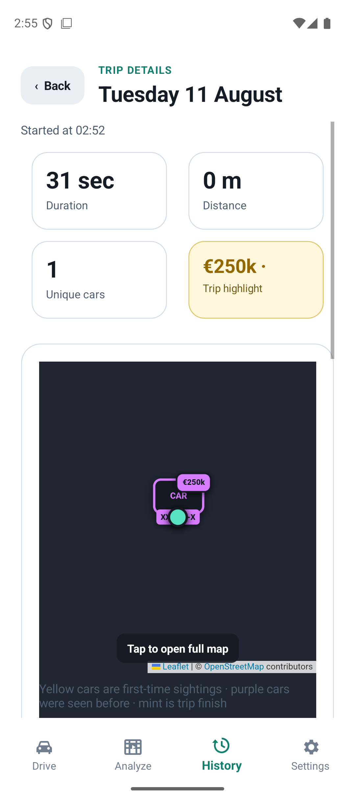
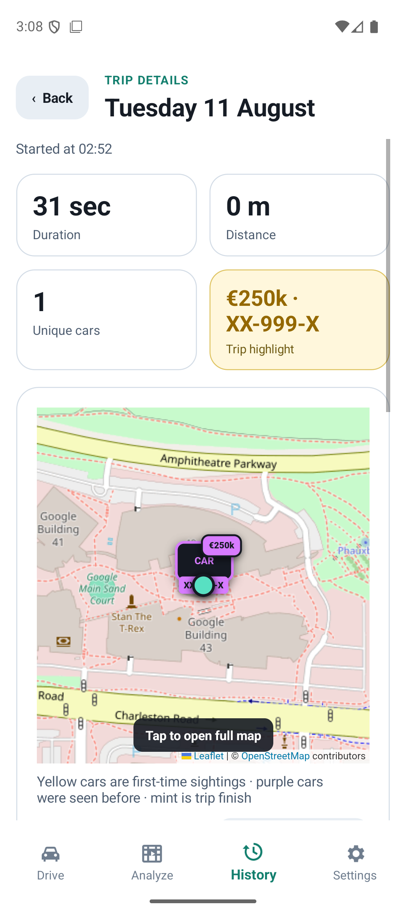

# Android screen-space audit

All screenshots below were captured from the Pixel 9 API 36 Android emulator at
1080 × 2424. The populated examples use a deliberately long vehicle name to
exercise the same constrained layouts that real RDW data can produce.

## Dashboard metrics

The old wrapping layout added outer margins to every metric and could measure the
highlight tile too short. The replacement keeps a true 12dp gap between tiles,
aligns them with the page content, and lets the price, label, and plate determine
the row height.

| Before | After |
| --- | --- |
|  |  |

## Settings card widths

Paired settings cards previously kept their desktop-only right gap after wrapping
onto separate phone rows. The first card was therefore 16dp narrower than the next
card. Wrapped cards now fill equally; the gap is restored only when the cards
actually sit side by side.

| Before | After |
| --- | --- |
|  |  |

## Vehicle list density

Vehicle rows reserved a fixed 72dp snapshot column even when no image existed.
The empty column now collapses, giving long make/model text the space it needs.

| Before | After |
| --- | --- |
|  |  |

## Vehicle profile wrapping

The hero card now wraps the plate and identity as complete blocks on narrow
screens, instead of forcing both into undersized columns. It returns to a compact
side-by-side layout in landscape.

| Before | After |
| --- | --- |
|  |  |

## Trip-detail alignment

The four trip metrics now use an edge-aligned 2 × 2 grid. This removes the extra
inset above the full-width map and gives the trip highlight enough measured height
for both its value and plate.

| Before | After |
| --- | --- |
|  |  |

## Emulator coverage

The audit covered light theme in portrait and landscape across:

- Drive setup and an active virtual-camera drive
- Analyze setup
- History dashboard, trips, and vehicles in empty and populated states
- Trip details, vehicle details, embedded maps, and the full-screen map
- Settings from top to bottom, including its wrapped and side-by-side card states
